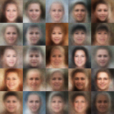

<h1 align="center">VAE</h1>

 In this project I coded and successfully trained a <strong>Variational Autoencoder (VAE)</strong> using a <a href="https://github.com/Peppooo/nn">library</a> I personally coded and still plan to improve.   Since my library currently only has fully connected layers, I decided to work with the <a href="https://github.com/nvlabs/ffhq-dataset">FFHQ dataset</a>, with images resized down to <strong>32×32</strong>. 

 Using just 32×32 RGB images, the model has <strong>7.5M learnable parameters</strong>. 

<h2>Samples</h2>

 Here are some samples from the trained models included in this repository: 

  

 <i>Samples generated by the model_ffhq32r.bin model</i> 

